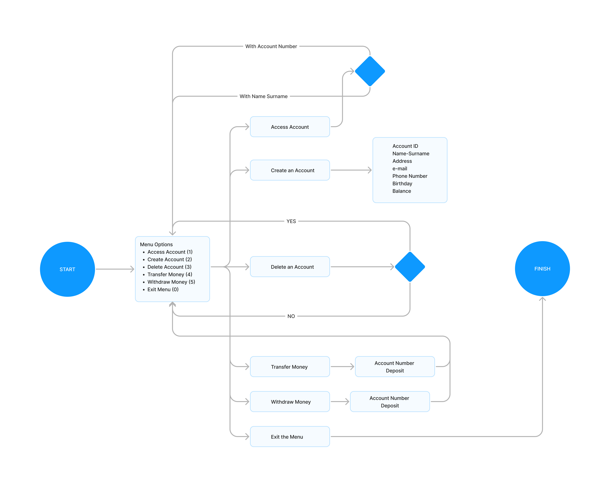
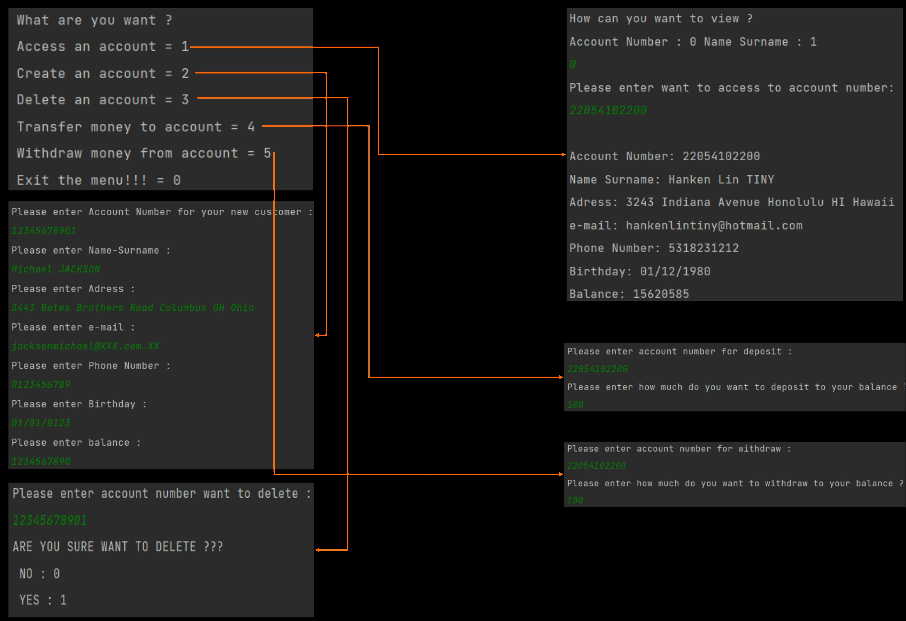
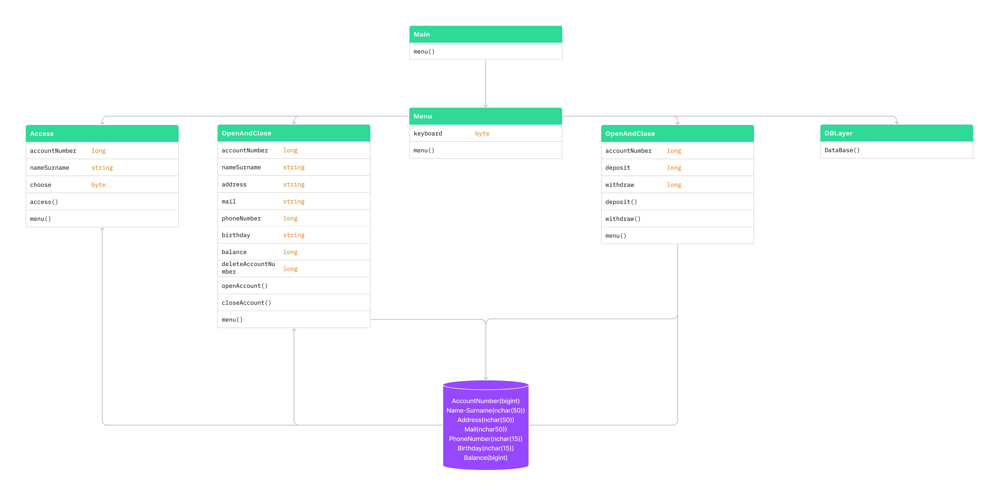

# Basic_MiniATM_User_System

This project is about basic atm system.
Viewing, creating, deleting and depositting and withdrawing money and this options work with SQL(Microsoft SQL).

The presentation is as shown below

  

  

  
